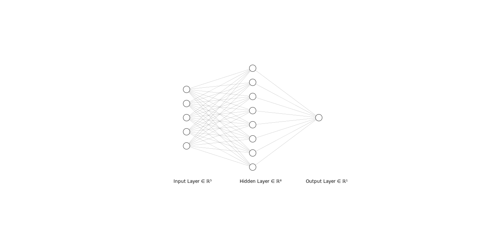

# Project2

## 1.Team member


- **m5268101 Liu** **Jiahe**

- **m5251140 Ken Sato**

- **m5271051 Keisuke** **Utsumi**


## 2.Team Project II

Team Project II

- Write a computer program for the BP algorithm.

- Test your program using the 4-bit parity check problem.

- The number of inputs is 5 (4 original inputs plus one

  dummy input) and the number of output is 1 (a real number in [0,1] or [-1,1]).

- The desired output is 1 if the number of ones in the inputs is even; otherwise, the output is 0 or -1.

- Check the performance of the network by changing the number of hidden neurons from 4, 6, 8, and 10.

- Provide a summary of your results in your report (txt-file).

## 3.Mathematical formulas

------

The problem is to input a 4-bit number (0 or 1) and output 1 if the number of 1  is even, and 0 otherwise.

For example:

- (0, 0, 0, 0, -1) -> 1

- (0, 1, 1, 1, -1) -> 0 
- (1, 0, 0, 1, -1) -> 1 
- (1, 0, 1, 1, -1) -> 0

To complete the code, we first need to **derive the mathematical formulas for forward propagation and backward propagation.**

Regarding the parity-check problem for 4-bit numbers, there are 5 input neurons, some neurons in the hidden layer, and 1 neuron in the output layer. The activation function for both the hidden and output layer neurons is the sigmoid function, whose original function and derivative are as follows:
$$
\sigma(x) = \frac{1}{1+e^{-x}} \quad\quad \frac{d\sigma(x)}{dx} = \sigma(x)(1-\sigma(x))
$$
Firstly, let's consider the forward propagation. The input matrix $X$ has a shape of $(m, n_0)$, where $m$ is the number of samples, and $n_0$ is the number of input features. In this problem, $n_0=5$. The target output matrix $Y$ has a shape of $(m, n_2)$, where $n_2$ is the number of neurons in the output layer. Here, $n_2=1$. The weight matrices $W^{(1)}$ and $W^{(2)}$ respectively represent the weights from the input layer to the hidden layer and from the hidden layer to the output layer. Their sizes are $(n_0, n_1)$ and $(n_1, n_2)$, where $n_1$ is the number of neurons in the hidden layer.

$A^{(1)}$ represents the activated input matrix of the hidden layer, with a size of $(m, n_1)$. The input matrix of the hidden layer, $Z^{(1)}$, has a size of $(m, n_1)$.


$$
Z^{(1)}=XW^{(1)} \quad\quad A^{(1)} = \sigma(Z^{(1)})
$$
Firstly, let's consider the forward propagation. The input matrix $X$ has a shape of $(m, n_0)$, where $m$ is the number of samples, and $n_0$ is the number of input features. In this problem, $n_0=5$. The target output matrix $Y$ has a size of $(m, n_2)$, where $n_2$ is the number of neurons in the output layer. Here, $n_2=1$. The weight matrices $W^{(1)}$ and $W^{(2)}$ respectively represent the weights from the input layer to the hidden layer and from the hidden layer to the output layer. Their sizes are $(n_0, n_1)$ and $(n_1, n_2)$, where $n_1$ is the number of neurons in the hidden layer.
$$
Z^{(2)}=A^{(1)}W^{(2)} \quad\quad A^{(2)} = \sigma(Z^{(2)})
$$
**Mean Squared Error Loss Function:**
$$
L = \frac{1}{2m} \sum_{i=1}^{m} (Y^{(i)} - A^{(2)(i)})^2
$$
**Use Backpropagation to find the partial derivative of the loss function with respect to the weights $W$.**
$$
\frac{\partial L}{\partial W^{(2)}} = \frac{\partial L}{\partial A^{(2)}}
\frac{\partial A^{(2)}}{\partial Z^{(2)}}
\frac{\partial Z^{(2)}}{\partial W^{(2)}}
$$

$$
\frac{\partial L}{\partial W^{(1)}} = \frac{\partial L}{\partial A^{(2)}}
\frac{\partial A^{(2)}}{\partial Z^{(2)}}
\frac{\partial Z^{(2)}}{\partial A^{(1)}}
\frac{\partial A^{(1)}}{\partial Z^{(1)}}
\frac{\partial Z^{(1)}}{\partial W^{(1)}}
$$

$$
(4) \Rightarrow  \frac{\partial L}{\partial A^{(2)}}=\frac{1}{m}(Y-A^{(2)})=\frac{1}{m}E
$$

**The variables $Y$, $A^{(2)}$, and $E$ mentioned above are all vectors.** 
$$
\begin{align*}
    \frac{\partial A^{(2)}}{\partial Z^{(2)}}=\frac{\partial \sigma (Z^{(2)})}{\partial Z^{(2)}}&=\sigma^{'}(Z^{(2)})\\
  	\frac{\partial Z^{(2)}}{\partial W^{(2)}}&=A^{(1)}
\end{align*}
$$

**Deriving$\frac{\partial L}{\partial W^{(2)}}$**
$$
\Rightarrow \frac{\partial L}{\partial W^{(2)}} = \frac{1}{m}E*\sigma^{'}(Z^{(2)})*A^{(1)T}
$$
Corresponding code:

```python
output_layer_error_term = error * sigmoid_derivative(output_layer_input)
dL_dW2 = np.dot(hidden_layer_output.T, output_layer_error_term) / len(inputs)
weights_hidden_output += learning_rate * dL_dW2
```


$$
\begin{align*}
	\frac{\partial Z^{(2)}}{\partial A^{(1)}}&=W^{(2)}\\
  \frac{\partial A^{(1)}}{\partial Z^{(1)}}&=\sigma^{'}(Z^{(1)})\\
  \frac{\partial Z^{(1)}}{\partial W^{(1)}}&=X
\end{align*}
$$
**Deriving$\frac{\partial L}{\partial W^{(1)}}$**
$$
\Rightarrow \frac{\partial L}{\partial W^{(1)}} = \frac{1}{m}E*\sigma^{'}(Z^{(2)})*W^{(2)T}*\sigma^{'}(Z^{(1)})*X^{T}
$$
Corresponding code:

```python
hidden_layer_error_term = np.dot(output_layer_error_term, weights_hidden_output.T) * sigmoid_derivative(hidden_layer_input)
dL_dW1 = np.dot(inputs.T, hidden_layer_error_term) / len(inputs)
weights_input_hidden += learning_rate * dL_dW1
```

## 4.Implement code

There are 3 files：

### [utils.py](./utils.py)

Implement necessary code：

```python
import numpy as np
from itertools import product

def sigmoid(x):
    return 1 / (1 + np.exp(-x))

def sigmoid_derivative(x):
    s = sigmoid(x)
    return s * (1 - s)

def generate_dataset():
    inputs = []
    outputs = []

    for a in '01':
        for b in '01':
            for c in '01':
                for d in '01':
                    input_vector = [int(a), int(b), int(c), int(d), -1]
                    inputs.append(input_vector)

                    num_of_ones = sum(input_vector[:-1])
                    output = 0 if num_of_ones % 2 else 1
                    outputs.append([output])

    inputs = np.array(inputs)
    outputs = np.array(outputs)

    return inputs, outputs

def generate_parity_dataset(n_parity):
    inputs = []
    outputs = []

    # Generate all possible n-bit binary combinations
    for binary_combination in product('01', repeat=n_parity): # Cartesian product
        input_vector = [int(bit) for bit in binary_combination]
        input_vector.append(-1)  # Add bias term
        inputs.append(input_vector)

        num_of_ones = sum(input_vector[:-1])
        output = 0 if num_of_ones % 2 == 0 else 1
        outputs.append([output])

    inputs = np.array(inputs)
    outputs = np.array(outputs)

    return inputs, outputs


def train(inputs, outputs, weights_input_hidden, weights_hidden_output, learning_rate, num_epochs):
    '''
    shape(inputs) = (2^n_parity, n_parity+1), shape(outputs) = (2^n_parity, 1)
    shape(weights_input_hidden) = (n_parity+1, hidden_neurons), shape(weights_hidden_output) = (hidden_neurons, 1)   
    '''
    loss_list = []
    for epoch in range(num_epochs):
        
        # Forward pass
        hidden_layer_input = np.dot(inputs, weights_input_hidden) # shape(hidden_layer_input) = (2^n_parity, hidden_neurons)
        hidden_layer_output = sigmoid(hidden_layer_input) 
        output_layer_input = np.dot(hidden_layer_output, weights_hidden_output) # shape(output_layer_input) = (2^n_parity, 1)
        output_layer_output = sigmoid(output_layer_input)

        # Calculate error and loss
        error = outputs - output_layer_output # shape(error) = (2^n_parity, 1), error is also the derivative of loss
        loss = 0.5 * np.mean(error ** 2) 
        loss_list.append(loss)
        # print(f"Epoch {epoch + 1}: Loss: {loss}")

        # Backpropagation
        output_layer_error_term = error * sigmoid_derivative(output_layer_input) # (2^n_parity, 1) = (2^n_parity, 1) * (2^n_parity, 1)
        dL_dW2 = np.dot(hidden_layer_output.T, output_layer_error_term) / len(inputs) # (hidden_neurons, 1) = (hidden_neurons, 2^n_parity)(2^n_parity, 1)

        # (2^n_parity, hidden_neurons) = (2^n_parity, 1)(1, hidden_neurons) * (2^n_parity, hidden_neurons)
        hidden_layer_error_term = np.dot(output_layer_error_term, weights_hidden_output.T) * sigmoid_derivative(hidden_layer_input)
        dL_dW1 = np.dot(inputs.T, hidden_layer_error_term) / len(inputs) # (n_parity+1, hidden_neurons) = (n_parity+1, 2^n_parity)(2^n_parity, hidden_neurons)

        # Update weights
        weights_hidden_output += learning_rate * dL_dW2
        weights_input_hidden += learning_rate * dL_dW1

    return weights_input_hidden, weights_hidden_output, loss_list

def test(inputs, weights_input_hidden, weights_hidden_output):
    hidden_layer_input = np.dot(inputs, weights_input_hidden)
    hidden_layer_output = sigmoid(hidden_layer_input)
    output_layer_input = np.dot(hidden_layer_output, weights_hidden_output)
    output_layer_output = sigmoid(output_layer_input)

    return output_layer_output


```


###  [project2.py](./project2.py)

Perform one round of training, output the weights and the loss function graph, and then test the trained model once. Since there are limited scenarios for the four-bit parity check, we will use all 16 data from the training set for testing.

```python
import numpy as np
import matplotlib.pyplot as plt

from utils import *


np.set_printoptions(linewidth=np.inf)


def main():

    n_parity = 4
    inputs, outputs = generate_parity_dataset(n_parity) # shape(inputs) = (16, 5), shape(outputs) = (16, 1)
    print( outputs )

    hidden_neurons = 8
    learning_rate = 2
    num_epochs = 50000

    input_size = inputs.shape[1] # shape(inputs) = (16, 5)
    output_size = outputs.shape[1] # shape(outputs) = (16, 1)

    weights_input_hidden = np.random.uniform(-1, 1, size=(input_size, hidden_neurons)) # shape(weights_input_hidden) = (5, 8)
    weights_hidden_output = np.random.uniform(-1, 1, size=(hidden_neurons, output_size)) # shape(weights_hidden_output) = (8, 1)

    weights_input_hidden, weights_hidden_output, loss_list = train(inputs, outputs, weights_input_hidden, weights_hidden_output, learning_rate, num_epochs)

    print(f"There are {hidden_neurons} hidden_neurons.")
    print("Training complete.")
    print("Weights from input layer to hidden layer:")
    print(weights_input_hidden)
    print("Weights from hidden layer to output layer:")
    print(weights_hidden_output)

    # Test the model on training data
    predictions = test(inputs, weights_input_hidden, weights_hidden_output) # shape(predictions) = (16, 1)

    # Print actual and predicted outputs
    print("\nTest the accuracy:\n")
    for i in range(inputs.shape[0]): # inputs.shape[0] = 16
        print(f"Input: {inputs[i]} | Desired Output: {outputs[i]} | Predicted Output: {predictions[i]}=>{np.round(predictions[i])},{np.round(predictions[i]) == outputs[i]}")

    # Calculate accuracy
    accuracy = np.mean(np.round(predictions) == outputs) * 100
    print(f"Accuracy on training data: {accuracy}%")

    plt.plot(range(num_epochs), loss_list)
    plt.xlabel('Epoch')
    plt.ylabel('Loss')
    plt.show()

if __name__ == "__main__":
    main()

```


### [draw_plot.py](./draw_plot.py)

Test with different numbers of hidden neurons and learning rates. The functionality of this file is to train with different combinations of learning rates and numbers of hidden neurons in the hidden layer. Since the accuracy of each training and testing process may fluctuate, ten training and testing processes are conducted for each pair of learning rate and number of hidden neurons. The final accuracy is calculated by taking the average of the ten testing results.

Each graph displays ten loss function curves, and the title of the graph shows the corresponding number of hidden neurons, learning rate, and model accuracy.
```python
import numpy as np
import matplotlib.pyplot as plt
from tqdm import tqdm
from utils import *

n_parity = 4
inputs, outputs = generate_parity_dataset(4)

learning_rates = [0.5, 1.0, 1.5, 2, 2.5, 3.0]
hidden_neurons_list = [4, 6, 8, 10, 12, 14]
num_epochs = 5000

num_repeats = 10


fig, axes = plt.subplots(len(learning_rates), len(hidden_neurons_list), figsize=(15, 10), sharex=True, sharey=True) 
fig.tight_layout(pad=4.0)

total_combinations = len(learning_rates) * len(hidden_neurons_list) * num_repeats
progress_bar = tqdm(total=total_combinations, desc="Training progress")

for i, lr in enumerate(learning_rates):
    for j, hidden_neurons in enumerate(hidden_neurons_list):
        accuracies = []
        max_loss = -np.inf
        min_loss = np.inf
        for repeat in range(num_repeats):
            input_size = inputs.shape[1]
            output_size = outputs.shape[1]
            weights_input_hidden = np.random.uniform(-1, 1, size=(input_size, hidden_neurons))
            weights_hidden_output = np.random.uniform(-1, 1, size=(hidden_neurons, output_size))

            weights_input_hidden, weights_hidden_output, loss_list = train(inputs, outputs, weights_input_hidden, weights_hidden_output, lr, num_epochs)

            axes[i, j].plot(range(num_epochs), loss_list, alpha=0.3)

            max_loss = max(max_loss, np.max(loss_list))
            min_loss = min(min_loss, np.min(loss_list))

            predictions = test(inputs, weights_input_hidden, weights_hidden_output)
            accuracy = np.mean(np.round(predictions) == outputs)
            accuracies.append(accuracy)

            progress_bar.update(1)

        mean_accuracy = np.mean(accuracies)
        axes[i, j].set_title(f"LR:{lr}, Hidden:{hidden_neurons}, Acc:{mean_accuracy:.2f}")
        axes[i, j].set_ylim(min_loss, max_loss)
        axes[i, j].set_xlabel("Epoch")
        axes[i, j].set_ylabel("Loss")

progress_bar.close()
plt.show()


```

## 5.Result discussion

### 1.project2

```python
hidden_neurons = 8
learning_rate = 2
num_epochs = 5000
```

Using the above parameters for testing, the neural network structure is as follows:


Using[project2.py](./project2.py)，the output results are as follows. The first is loss function graph:


It can be seen that the loss value drops significantly at a certain stage, indicating that the model has learned the pattern between the data.

Then, the program will output the weight matrix of the model.

```python
Training complete.
Weights from input layer to hidden layer:
[[-2.31644425 -0.63039741 -3.57731934 -1.04625514 -1.25227723 -6.18501899  1.431915    4.77349946]
 [-2.15748164 -0.31308126 -3.57955329 -0.65912048 -0.5021715  -6.14898936  1.47622154  4.73967536]
 [ 0.32974164 -0.05176128  3.95640313 -0.64162932 -0.16245872  5.72925796 -1.64498763 -4.69839852]
 [ 1.48133044  0.05978481 -1.31046318 -0.45520148 -0.92089128  5.43126401  3.67404465 -4.12666975]
 [ 1.14864812  0.63524123  0.44982406  0.6552721   0.81828722  2.13236256  0.3013925   1.47702114]]
Weights from hidden layer to output layer:
[[ 2.74413683]
 [ 0.79679478]
 [ 5.64768705]
 [-0.90614131]
 [-1.00069039]
 [-8.97386301]
 [ 4.40344738]
 [-5.17288463]]
```

After that, the program will use the training set as the test data, output the model's predicted output and the desired output of the training set, and calculate the accuracy.

```python
Test the accuracy:

Input: [ 0  0  0  0 -1] | Desired Output: [1] | Predicted Output: [0.9268844]=>[1.],[ True]
Input: [ 0  0  0  1 -1] | Desired Output: [0] | Predicted Output: [0.19078016]=>[0.],[ True]
Input: [ 0  0  1  0 -1] | Desired Output: [0] | Predicted Output: [0.08886483]=>[0.],[ True]
Input: [ 0  0  1  1 -1] | Desired Output: [1] | Predicted Output: [0.94171521]=>[1.],[ True]
Input: [ 0  1  0  0 -1] | Desired Output: [0] | Predicted Output: [0.04732206]=>[0.],[ True]
Input: [ 0  1  0  1 -1] | Desired Output: [1] | Predicted Output: [0.91286132]=>[1.],[ True]
Input: [ 0  1  1  0 -1] | Desired Output: [1] | Predicted Output: [0.89465911]=>[1.],[ True]
Input: [ 0  1  1  1 -1] | Desired Output: [0] | Predicted Output: [0.04239285]=>[0.],[ True]
Input: [ 1  0  0  0 -1] | Desired Output: [0] | Predicted Output: [0.16491239]=>[0.],[ True]
Input: [ 1  0  0  1 -1] | Desired Output: [1] | Predicted Output: [0.19063355]=>[0.],[False]
Input: [ 1  0  1  0 -1] | Desired Output: [1] | Predicted Output: [0.94086615]=>[1.],[ True]
Input: [ 1  0  1  1 -1] | Desired Output: [0] | Predicted Output: [0.26320072]=>[0.],[ True]
Input: [ 1  1  0  0 -1] | Desired Output: [1] | Predicted Output: [0.90727252]=>[1.],[ True]
Input: [ 1  1  0  1 -1] | Desired Output: [0] | Predicted Output: [0.25959473]=>[0.],[ True]
Input: [ 1  1  1  0 -1] | Desired Output: [0] | Predicted Output: [0.05040591]=>[0.],[ True]
Input: [ 1  1  1  1 -1] | Desired Output: [1] | Predicted Output: [0.88746894]=>[1.],[ True]
Accuracy on training data: 93.75%

```


### 2.draw plot

Train multiple models to discover patterns.Next, with [draw_plot.py](./draw_plot.py)，We are use the following combinations of hidden layer neuron numbers and learning rates:

```python
learning_rates = [0.5, 1.0, 1.5, 2, 2.5, 3.0]
hidden_neurons_list = [4, 6, 8, 10, 12, 14]
num_epochs = 10000
```


The output image is as follows:


It can be seen that within a certain range, the more hidden layer neurons and the higher the learning rate we use, the higher the accuracy and the better the performance of the model is.

### 3.Question

Question：When the loss function value is between 0.125 and 0.03, it remains almost stable without decreasing for a long period of epochs. Why?

Hypothesis: When the loss function is equal to these two values, the neural network enters a phase of local optimal solution, so the gradient is small, the weight update is slow, and the loss function will be almost constant. Continuing training, the neural network jumps out of the local optimal solution, the gradient increases, the weight starts to update, and the loss function continues to decrease.

### 4.try more hidden layers

The code is [more_hidden_neurous.py](./more_hidden_neurous.py) and the result is not better than just 1 hidder layer


